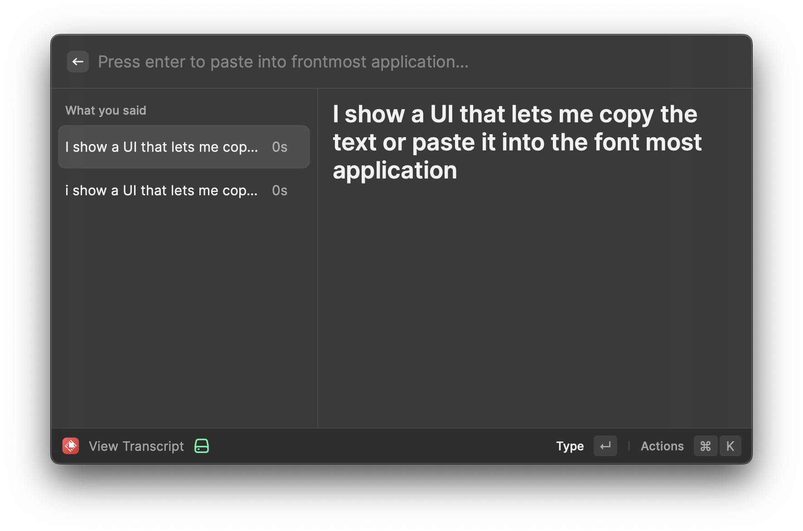

# What you said

A duct-taped Raycast extension that uses [dtinth/transcribe](https://github.com/dtinth/transcribe) to convert speech to text in the background and show a UI that lets me copy the text or paste it into the frontmost application.

